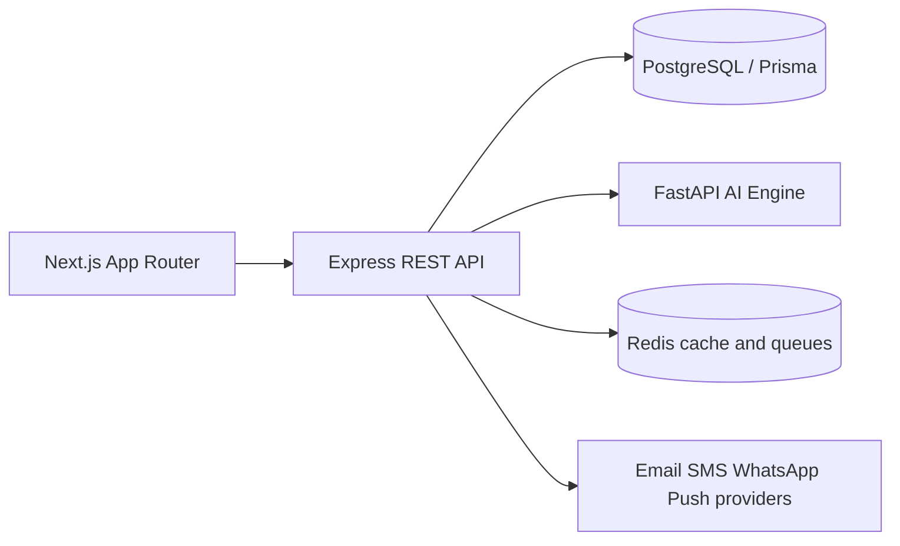
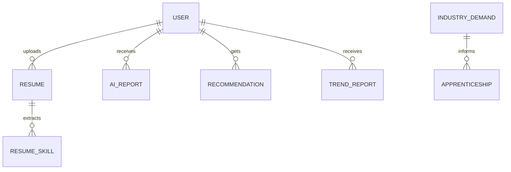
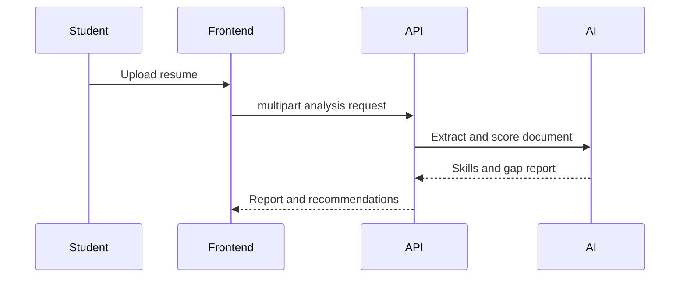

# Architecture

```mermaid
flowchart LR
  Browser[Next.js App Router] --> API[Express REST API]
  API --> DB[(PostgreSQL / Prisma)]
  API --> AI[FastAPI AI Engine]
  API --> Redis[(Redis cache and queues)]
  API --> Providers[Email SMS WhatsApp Push providers]
```

```mermaid
erDiagram
  USER ||--o{ RESUME : uploads
  USER ||--o{ AI_REPORT : receives
  USER ||--o{ RECOMMENDATION : gets
  USER ||--o{ TREND_REPORT : receives
  RESUME ||--o{ RESUME_SKILL : extracts
  INDUSTRY_DEMAND ||--o{ APPRENTICESHIP : informs
```

```mermaid
sequenceDiagram
  Student->>Frontend: Upload resume
  Frontend->>API: multipart analysis request
  API->>AI: Extract and score document
  AI-->>API: Skills and gap report
  API-->>Frontend: Report and recommendations
```
